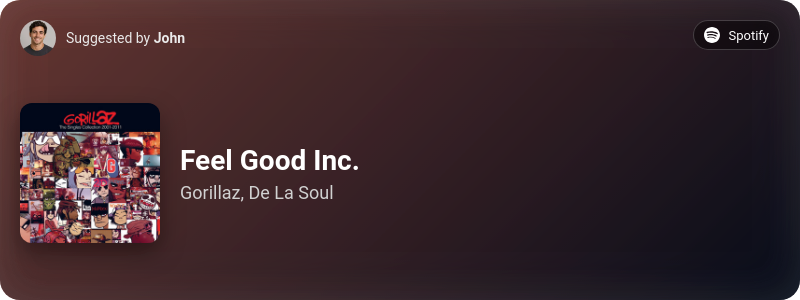

<a id="readme-top"></a>

<br />
<div align="center">
  
  <h1 align="center">Audiq</h1>
  <p align="center">
    A Discord music suggestion bot with slash commands, auto-generated song cards and multi-language support.
  </p>
</div>

<details>
  <summary>Table of Contents</summary>
  <ol>
    <li><a href="#about-the-project">About The Project</a></li>
    <li><a href="#features">Features</a></li>
    <li><a href="#getting-started">Getting Started</a>
      <ul>
        <li><a href="#prerequisites">Prerequisites</a></li>
        <li><a href="#installation">Installation</a></li>
      </ul>
    </li>
    <li><a href="#docker-deployment">Docker Deployment</a></li>
    <li><a href="#configuration">Configuration</a></li>
    <li><a href="#commands">Commands</a></li>
    <li><a href="#localization">Localization</a></li>
    <li><a href="#credits">Credits</a></li>
    <li><a href="#license">License</a></li>
  </ol>
</details>

## About The Project
<div align="center">
  
</div>


Audiq is a Discord bot built for music communities. It lets users suggest songs via slash commands, generates attractive card previews for each suggestion, and posts them into a configured channel.

The bot uses a centralized dictionary for all user-facing text, making it easy to add new languages and keep command descriptions, replies, and error messages in one place.

Audiq currently supports the following streaming and music content platforms:

- Spotify
- YouTube
- YouTube Music
- SoundCloud

<p align="right">(<a href="#readme-top">back to top</a>)</p>

## Features

- Global slash command registration for Discord
- Dynamic language selection through environment variables
- Centralized text dictionary (`src/config/dictionary.json`)

<p align="right">(<a href="#readme-top">back to top</a>)</p>

## Getting Started

### Prerequisites

- Node.js (v18+ recommended)
- npm

### Installation

1. Clone the repository:
   ```sh
   git clone https://github.com/estaniel/discord-music-suggest-bot.git
   cd discord-music-suggest-bot
   ```

2. Install dependencies:
   ```sh
   npm install
   ```

3. Create a Discord application and bot:
   - Open the [Discord Developer Portal](https://discord.com/developers/applications)
   - Click **New Application**
   - Go to **Bot**, click **Add Bot**
   - Copy the bot token for the next step

4. Create a `.env` file in the project root:
   ```env
   DISCORD_TOKEN=your_bot_token_here
   CLIENT_ID=your_application_client_id_here
   LANGUAGE=en_US
   ```

5. Invite the bot to your server:
   - In the Developer Portal, go to **OAuth2 > URL Generator**
   - Select scopes: `bot`, `applications.commands`
   - Select bot permissions: `View Channels`, `Send Messages`, `Manage Channels` (optional for setup checks)
   - Use the generated URL to add the bot to your server

6. Deploy slash commands globally:
   ```sh
   npm run deploy
   ```

7. Start the bot:
   ```sh
   npm start
   ```

### Docker Deployment

If you prefer to run Audiq with Docker, this repository includes a `Dockerfile` and `docker-compose.yml`.

1. Make sure you have a `.env` file in the project root with the required values.
2. Build the Docker image:
   ```sh
   docker build -t audiq .
   ```
3. Start the container:
   ```sh
   docker compose up -d --build
   ```

The compose setup mounts `./src/config` into the container so `src/config/data.json` is persisted on the host.

To stop the bot:
```sh
docker compose down
```

<p align="right">(<a href="#readme-top">back to top</a>)</p>

## Configuration

The bot stores the configured music channel in `src/config/data.json` after `/setup` is run.

Use `/setup channel:#your-channel` to set the destination channel for suggestions.

If `src/config/data.json` does not exist, it will be created automatically.

<p align="right">(<a href="#readme-top">back to top</a>)</p>

## Commands

- `/setup channel:#channel`
  - Configures the channel where suggestion cards will be posted.
  - Requires the user to have `MANAGE_CHANNELS` permission.

- `/suggest link:<song-url> [vote:true/false]`
  - Suggests a song by URL or link.
  - Generates a visual song card and posts it to the configured channel.
  - Optional `vote` parameter: when set to `true` (default), adds a 💎 reaction to the suggestion card for voting/rating.

- `/ping`
  - Replies with the current Discord API latency.

- `/help`
  - Shows the list of available slash commands.

<p align="right">(<a href="#readme-top">back to top</a>)</p>

## Localization

Audiq supports multiple languages through the `LANGUAGE` environment variable.

Example:
```sh
LANGUAGE=es_UY npm start
```

The default value is `en_US`. The current dictionary file is located at `src/config/dictionary.json` and includes:

- `en_US` — English
- `es_UY` — Uruguayan Spanish

You can add additional locales by extending this JSON file and using the new language code in the environment.

<p align="right">(<a href="#readme-top">back to top</a>)</p>

## Credits

This project is built with:

- [discord.js](https://discord.js.org/) for Discord bot interactions
- [dotenv](https://www.npmjs.com/package/dotenv) for environment variable management
- [node-html-to-image](https://www.npmjs.com/package/node-html-to-image) for generating PNG cards
- [colorthief](https://www.npmjs.com/package/colorthief) for palette extraction
- [play-dl](https://www.npmjs.com/package/play-dl) for music metadata extraction
- [soundcloud-scraper](https://www.npmjs.com/package/soundcloud-scraper) for SoundCloud support
- [sharp](https://www.npmjs.com/package/sharp) for image processing dependencies

Special thanks to the open source community for the tools and libraries that make this possible.

<p align="right">(<a href="#readme-top">back to top</a>)</p>

## License

Distributed under the MIT License. See `LICENSE.txt` for more information.

<p align="right">(<a href="#readme-top">back to top</a>)</p>
